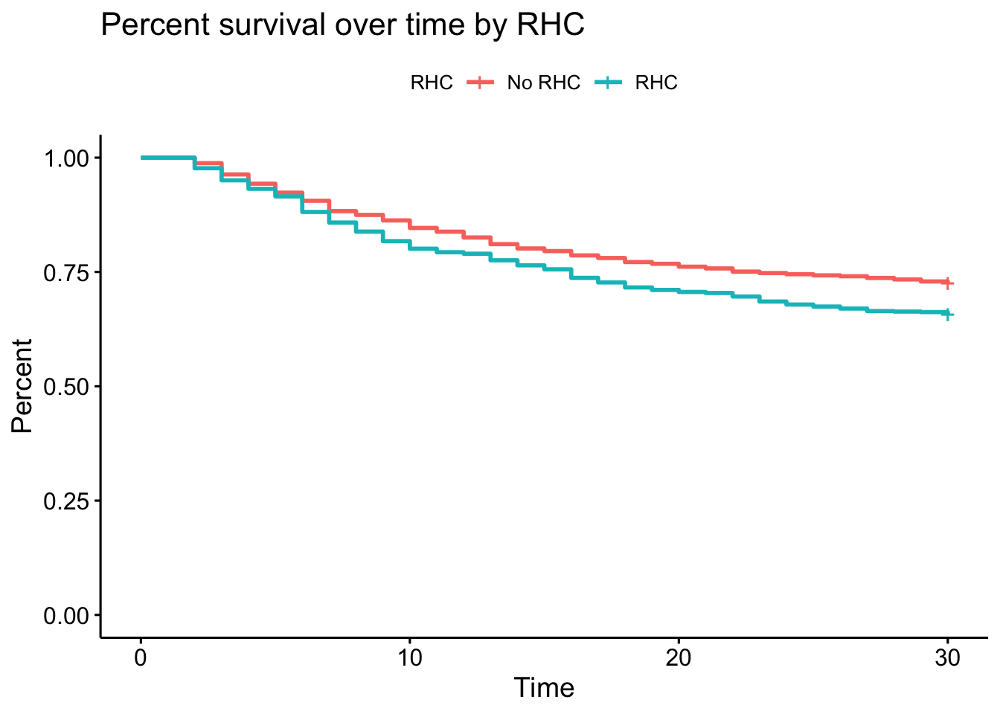

# Instructions

This week, you learned how to write for loops and practiced purrr. In this milestone, you'll continue writing functions to analyze the RHC data sets. 

You'll also recreate this Quarto report that calls the functions you've written:  
https://rsacdn.link/milestones/internal/pinr/heart-catheterization/assets/heart-report.html

To learn more about the variables contained in the data set, refer to the data dictionary here: https://rsacdn.link/milestones/internal/pinr/heart-catheterization/assets/heart-catheterization_dictionary.html

# Milestone

```{r}
#| label: setup
#| include: false
source("heart-catheterization_04_loops.R")
# Load your packages here
library(survival)
library(survminer)
```

## Milestone 4

In this milestone, you'll write a new function that plots Kaplan-Meier curves. Then, you'll use your functions to create a report.

## Recreation

## Part 1 - Kaplan-Meier curves

Kaplan-Meier curves estimate the probability of survival over time. You want to write function that plots Kaplan-Meier curves for the RHC data sets. 

The following code uses functions from the survival and survminer packages to create a Kaplan-Meier curve for the cirrhosis data. Source `heart-catheterization_04_loops.R`, then run the following code.

```{r}
#| label: kaplan-meier
cirrhosis <- read_rhc("data/cirrhosis.csv")
cirrhosis_surv <-
  cirrhosis |>
  mutate(surv_object = Surv(time = time, event = death))

fit <- survfit(surv_object ~ rhc, data = cirrhosis_surv)

fit |>
  ggsurvplot(
    data = cirrhosis_surv,
    legend.title = "",
    legend.labs = c("No RHC", "RHC"),
    ylab = "Percent survival",
    xlab = "Time",
    title = "Percent survival over time "
  )
```

Using the above code, write a function named `kaplan_meier()` that:

* Takes 5 arguments:
  * `data`
  * `title`: Plot title
  * `legend_title`: Legend title
  * `x`: x-axis label
  * `y`: y-axis label
* Plots a Kaplan-Meier curve for `data`, using `title`, `legend_title`, `x`, and `y` to set various plot labels

`title`, `legend_title`, `x`, and `y` should all have default values. Use the values provided in the code in the `kaplan-meier` chunk as default values.

Write your function in the script. When you're done, run the following code to test your function.

```{r}
#| label: compare
kaplan_meier(
  data = read_rhc("data/arf.csv"),
  title = "Percent survival over time by RHC",
  legend_title = "RHC",
  x = "Time",
  y = "Percent"
)
```

Your plot should match this one:

```{r}
#| echo: false

```

## Part 2 - Report

Next, use the functions in `heart-catheterization_04_loops.R` to recreate [this Quarto report](https://rsacdn.link/milestones/internal/pinr/heart-catheterization/assets/heart-report.html

To re-create the report, first open a new Quarto document. You will need to: 

1. Click **File > New file > Quarto Document**. 

2. Give your Quarto file a title, then click **Create**. 

3. Add R code and text to your Quarto document to recreate the report. Pay attention to chunk options (e.g. `echo`, `warning`, etc.) and markdown formatting (e.g. section headers) to make your report look like the example. *Hint*: Make sure you source the `heart-catheterization_04_loops.R` file in the setup chunk of your Quarto document.

## Extension

For your extension, consider any of the following:
1. Adding to your report
2. Writing additional functions to analyze the RHC data sets
3. Using your new skills in for loops _or_ purrr in some way
4. Investigating something else of interest to you


